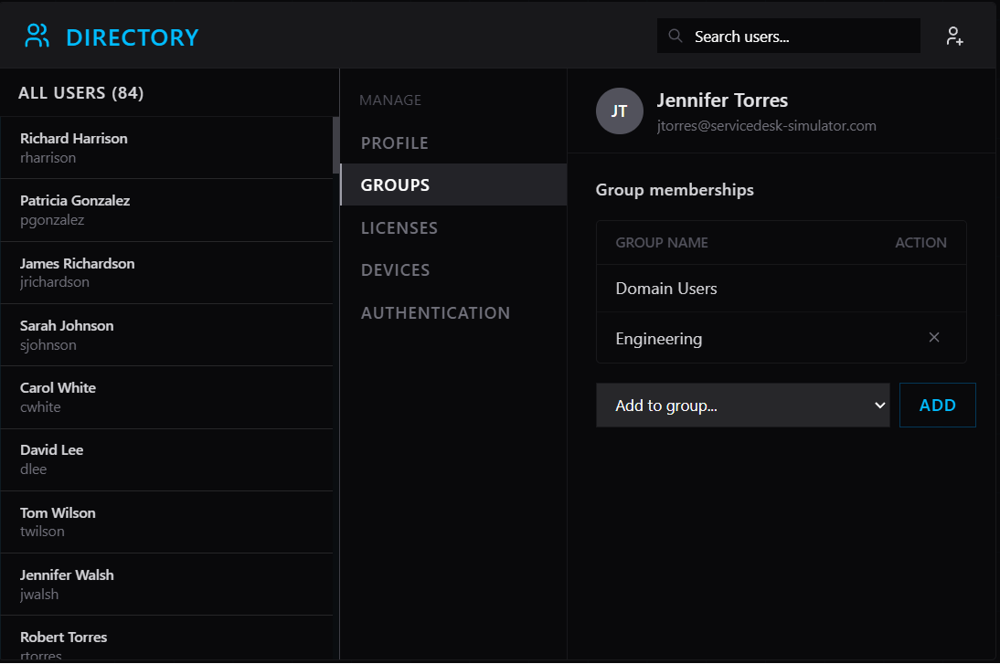
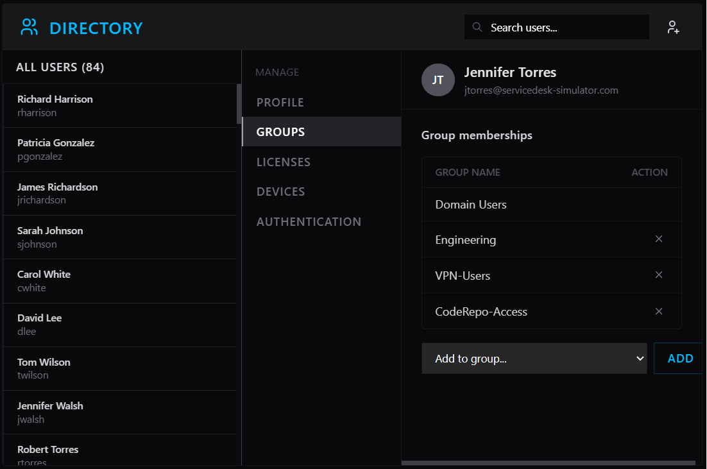

# INC0012853 – New Hire Account Setup

**Priority:** Medium  
**Request Type:** New Hire Access Setup  
**User:** Jennifer Torres  
**Username:** jtorres  
**Email:** jtorres@servicedesk-simulator.com  
**Department:** Engineering  
**Position:** Junior Developer  
**Manager:** Tom Wilson  
**Start Date:** 2026-02-10  
**Date Completed:** August 6, 2026

## Summary
HR requested creation of a new employee Directory account for Jennifer Torres (Junior Developer, Engineering) with the required group memberships so access would be ready for Monday orientation.

## Steps Taken
1. Claimed the ticket.
2. Opened Directory and created a new AD user with the following details:
   - Username: jtorres
   - Full Name: Jennifer Torres
   - Email: jtorres@servicedesk-simulator.com
   - Department: Engineering
   - Job Title: Junior Developer
3. Navigated to the Groups tab for the new user.
4. Added the required security groups:
   - Engineering
   - VPN-Users
   - CodeRepo-Access
5. Verified the user appeared correctly in Directory and that all three groups were listed.
6. Added resolution notes and closed the ticket.

## Resolution
New hire account successfully created and provisioned with all requested access. Account is ready for the employee’s start date / orientation.

## Skills Demonstrated
- Creating new user accounts in Active Directory / Directory
- Assigning multiple security groups
- Following new-hire onboarding procedures
- Accurate ticket documentation and closure

## Evidence
Screenshots taken of:
- Create New AD User form
- Group memberships showing Engineering, VPN-Users and CodeRepo-Access

## Screenshots

  
*Creating the new AD user account with correct details*

  
*New user profile after account creation*

  
*User successfully added to Engineering, VPN-Users, and CodeRepo-Access groups*
