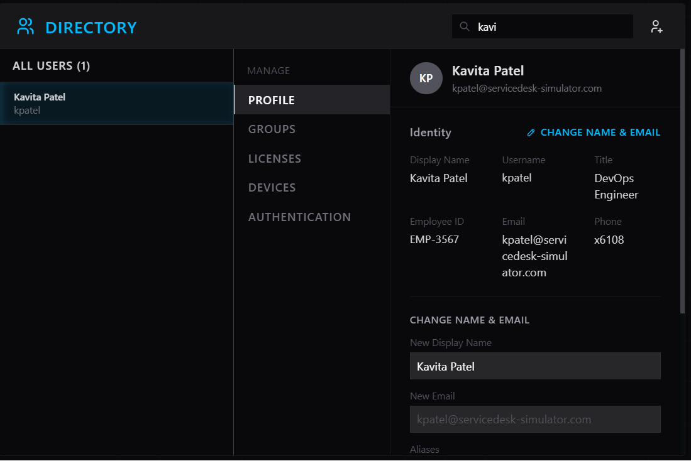
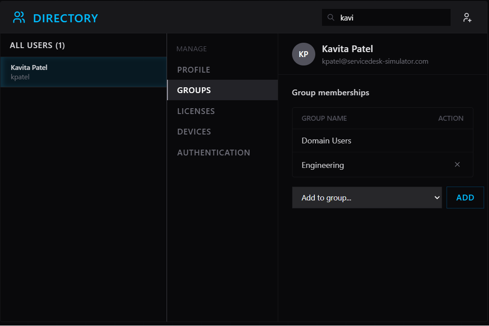
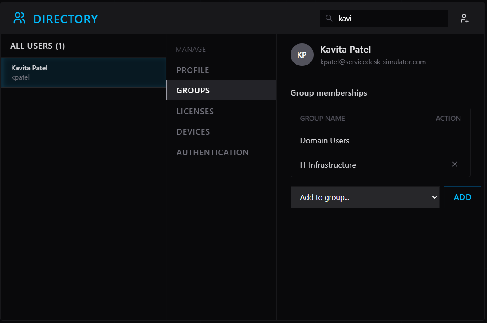

# INC0012860 – Department Transfer Access Modification

**Priority:** Medium  
**Request Type:** Access Modification – Department Transfer  
**User:** Kavita Patel (`kpatel`)  
**Previous Department:** Engineering  
**New Department:** IT Infrastructure  
**Effective Date:** 2026-02-05  
**Date Completed:** August 7, 2026

## Summary
User was transferring from Engineering to IT Infrastructure. Per security policy, previous Engineering access needed to be revoked and appropriate Infrastructure access granted so the user would have the correct permissions on their first day in the new role.

## Steps Taken
1. Claimed the ticket and located the user account for `kpatel` in Directory.
2. Reviewed current group memberships (user was a member of the Engineering group).
3. Removed the Engineering group membership to revoke previous access.
4. Added the IT Infrastructure group to grant the required access for the new role.
5. Verified the final group list showed only Domain Users + IT Infrastructure.
6. Confirmed the user profile details remained accurate.
7. Added clear resolution notes and closed the ticket.

## Resolution
Access successfully updated in line with the department transfer and security policy:
- Engineering group membership removed
- IT Infrastructure group membership added

User now has the correct access for their new role in IT Infrastructure, ready for the Wednesday start date.

## Skills Demonstrated
- Active Directory group management
- Following least-privilege / security best practices (revoke old access before or while granting new access)
- Handling department transfer / joiner-mover-leaver style requests
- Clear and auditable ticket documentation

## Screenshots
  
*User profile confirming identity and current role details*

  
*Original group membership showing Engineering access*

  
*Updated group membership after removing Engineering and adding IT Infrastructure*

