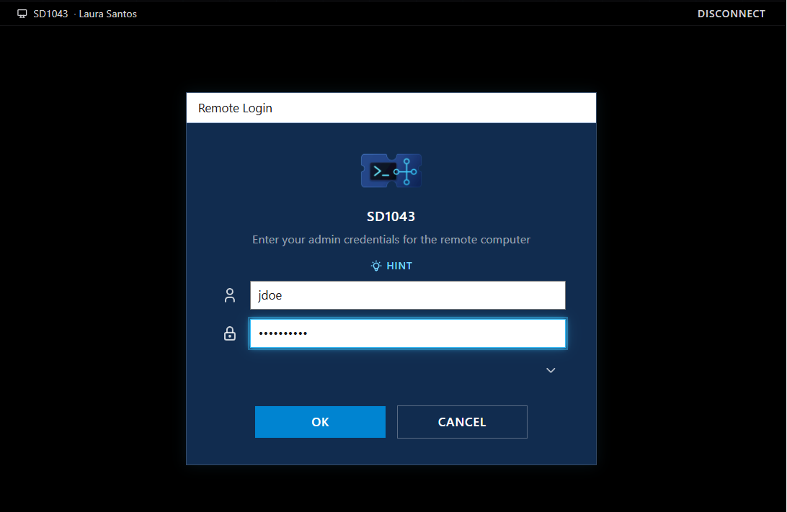
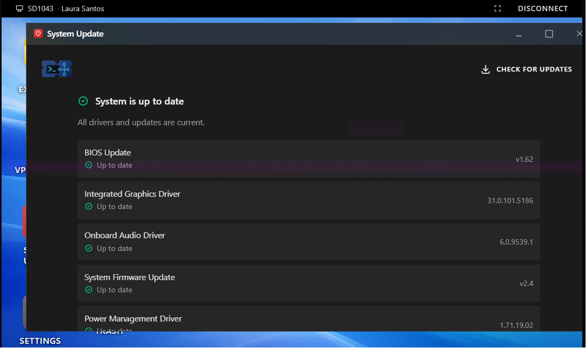
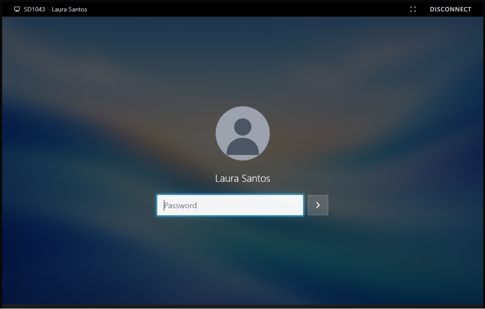

# INC0012862 – Second Monitor No Signal / Display Issue

**Priority:** Medium  
**Request Type:** Hardware / Display Troubleshooting  
**User:** Laura Santos  
**Department:** Finance  
**Location:** Floor 2  
**Date Completed:** August 8, 2026

## Summary
User reported that their second monitor suddenly displayed “No Signal” and was no longer detected by the PC. The monitor itself powered on and worked correctly when tested on a colleague’s laptop. Basic cable and port troubleshooting had already been performed by the user. The issue was causing significant productivity impact during month-end financial reporting.

## Steps Taken
1. Claimed the ticket and initiated a remote support session to the user’s workstation.
2. Observed glitchy display behavior with random colors on the remote session.
3. Reviewed installed updates and drivers via the System Update tool — all components (BIOS, Integrated Graphics, Discrete Graphics, Audio, Firmware, and Power Management) were confirmed up to date.
4. Restarted the workstation remotely.
5. Reconnected after the restart and confirmed the display had returned to normal operation with no random color artifacts or signal issues.
6. Verified the second monitor was functioning correctly.
7. Added resolution notes and closed the ticket.

## Resolution
The second monitor issue was resolved following a remote restart of the workstation. Display returned to optimal condition with no further “No Signal” or color distortion problems. User regained full dual-monitor functionality.

## Skills Demonstrated
- Remote desktop support
- Display / graphics troubleshooting
- Driver and firmware verification
- Methodical isolation of hardware vs software causes
- Clear documentation of troubleshooting steps and outcome

## Screenshots

  
*Initiating remote support session to the affected workstation*

  
*Verified all drivers and firmware were up to date before restarting*

  
*Workstation back online after restart with display functioning normally*
