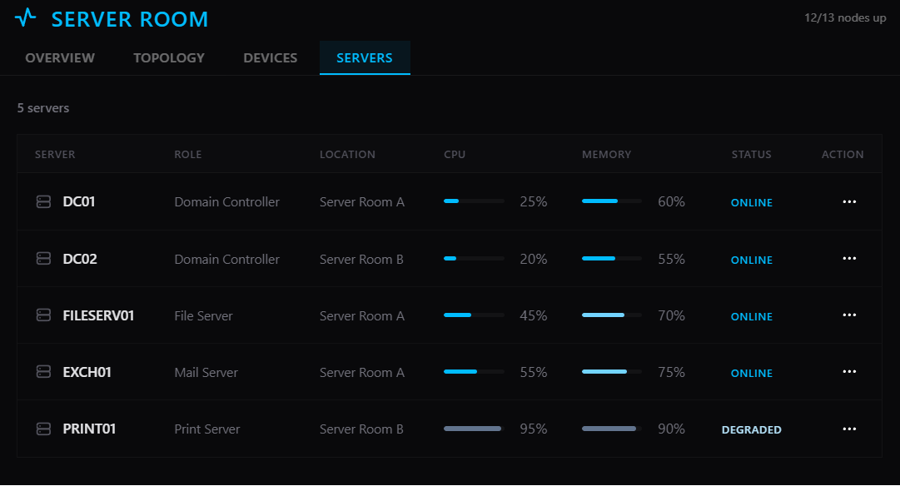
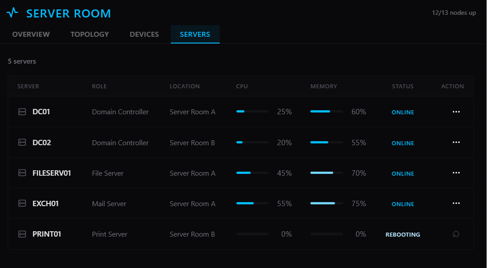
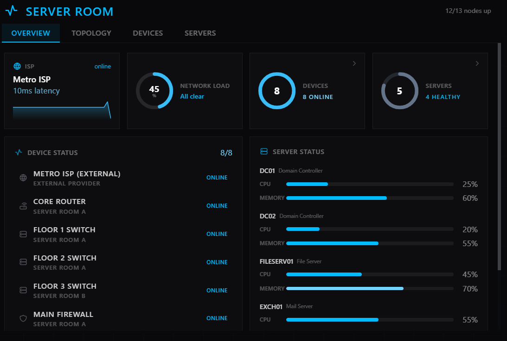
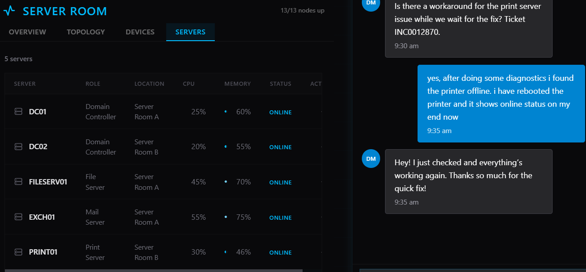

# INC0012870 – All Printers Offline (Print Server Failure)

**Priority:** High  
**Request Type:** Infrastructure / Print Services  
**Reported by:** Dorothy Martinez  
**Department:** Legal  
**Location:** Floor 2  
**Date Completed:** August 9, 2026

## Summary
All printers across the office were showing as offline. Users on multiple floors were unable to print. The issue had high business impact as the Legal team needed to print contracts and executive presentations were blocked. The problem affected the entire building rather than individual devices.

## Steps Taken
1. Claimed the high-priority ticket.
2. Opened the Server Room and reviewed server status.
3. Identified that the Print Server (PRINT01) was in a **DEGRADED** state (high CPU and memory utilization).
4. Initiated a reboot of PRINT01.
5. Monitored the server while it showed **REBOOTING** status.
6. Confirmed PRINT01 returned to **ONLINE** status after the reboot.
7. Communicated with the user, who verified that printing had been restored across the office.
8. Added resolution notes and closed the ticket.

## Resolution
Root cause was a degraded Print Server (PRINT01).  
Rebooting the print server restored full print services. All printers returned to online status and users confirmed normal printing functionality.

## Skills Demonstrated
- High-priority incident handling
- Server Room / infrastructure troubleshooting
- Identifying and resolving print server issues
- Clear communication with the affected user during a business-critical outage
- Structured documentation of root cause and resolution

## Screenshots

  
*PRINT01 showing DEGRADED status with elevated CPU and memory usage*

  
*Initiated reboot of the Print Server*

  
*Server Room overview during troubleshooting*

  
*PRINT01 restored to ONLINE and user confirmed printing was working again*
