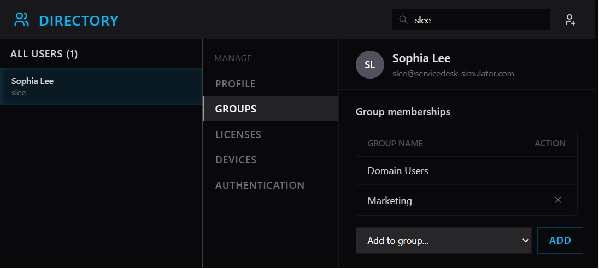
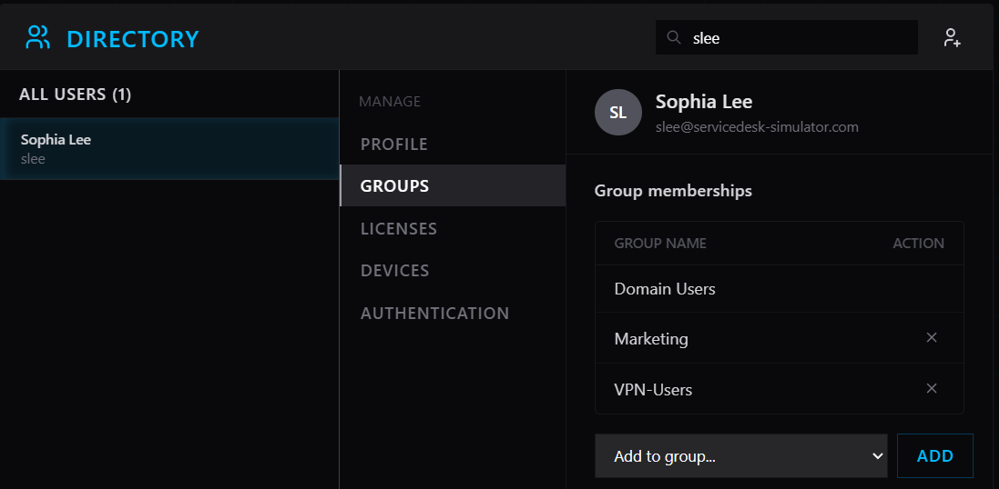
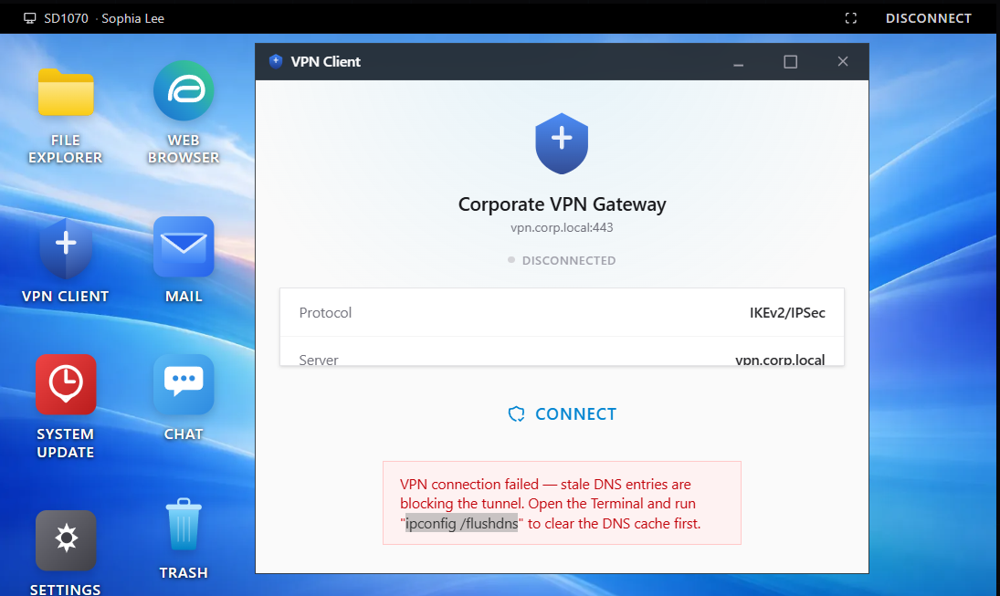
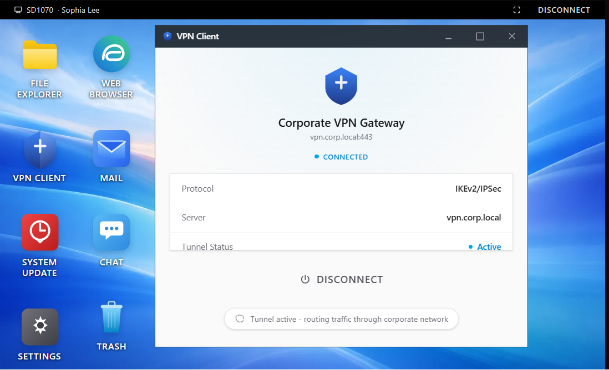

# NET17858250052021 – VPN Disconnected and Won’t Reconnect

**Priority:** High  
**Request Type:** Remote Access / VPN  
**User:** Sophia Lee (`slee`)  
**Department:** Marketing  
**Location:** Remote (Working from home)  
**Date Completed:** August 12, 2026

## Summary
Remote user reported that her VPN had disconnected and would not reconnect. She was unable to access any internal resources while working from home. This was a high-priority issue due to complete loss of connectivity to corporate systems.

## Steps Taken
1. Claimed the high-priority ticket.
2. Checked the user’s group memberships in Directory and found she was missing from the **VPN-Users** group.
3. Added the user back to the VPN-Users group.
4. Initiated a remote support session to the user’s workstation.
5. Opened the VPN Client and observed the error: “VPN connection failed — stale DNS entries are blocking the tunnel.”
6. Opened Terminal (Run as Administrator) and executed `ipconfig /flushdns` to clear the DNS resolver cache.
7. Restarted the workstation.
8. Confirmed the VPN could reconnect successfully after the restart.
9. Added resolution notes and closed the ticket.

## Resolution
Two issues were identified and resolved:
- User had lost membership in the VPN-Users group → restored.
- Stale DNS entries were blocking the VPN tunnel → cleared with `ipconfig /flushdns` followed by a restart.

VPN connectivity fully restored. User can again access internal resources.

## Skills Demonstrated
- VPN and remote access troubleshooting
- Active Directory group membership management
- DNS cache troubleshooting (`ipconfig /flushdns`)
- Remote desktop support
- High-priority incident handling for remote workers

## Screenshots

  
*User was missing from the VPN-Users group*

  
*VPN-Users group membership restored*

  
*VPN Client showing the stale DNS entries error*

  
*Successfully cleared the DNS resolver cache*
