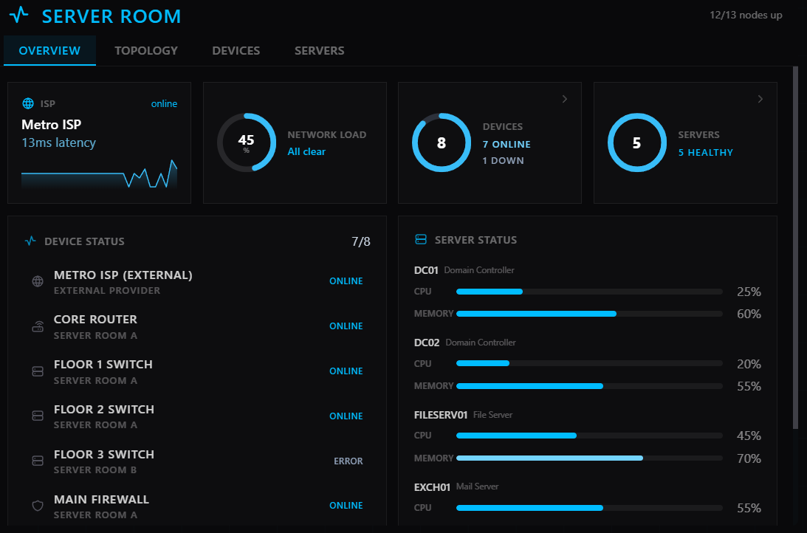
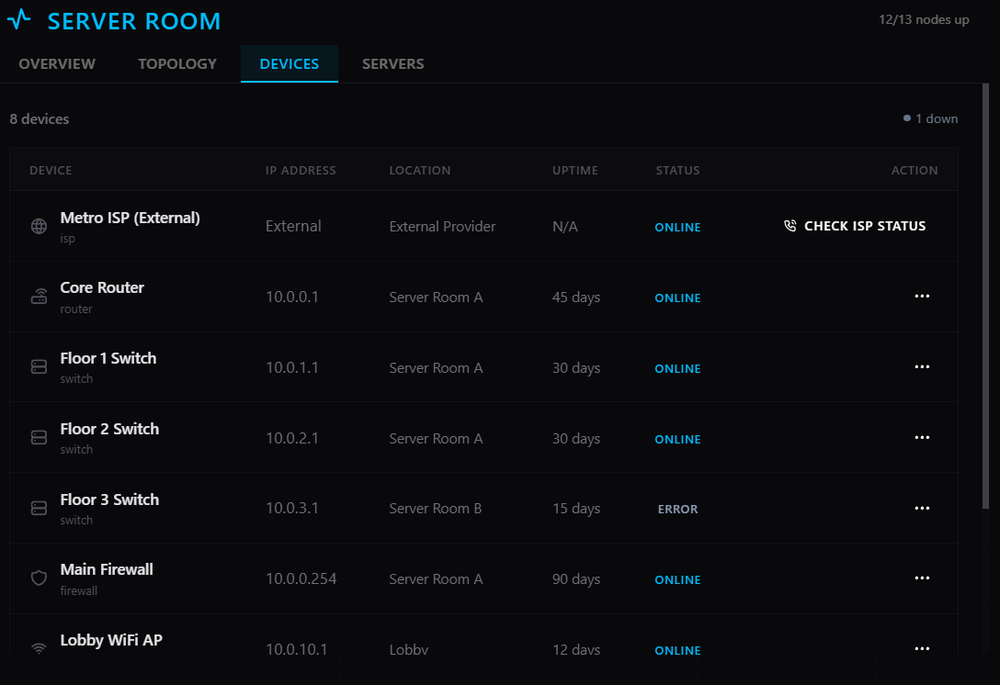
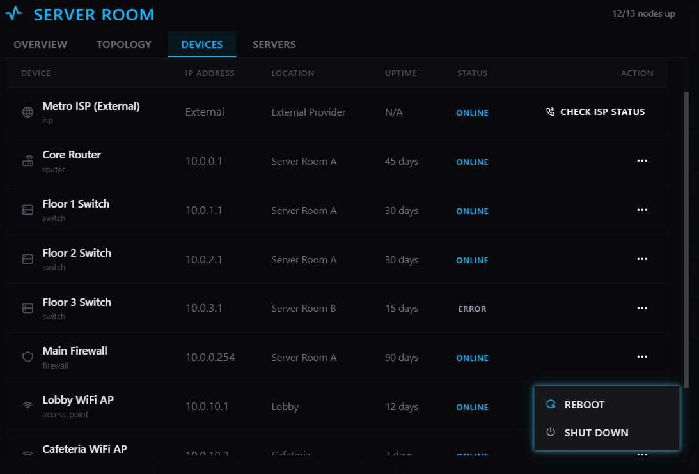
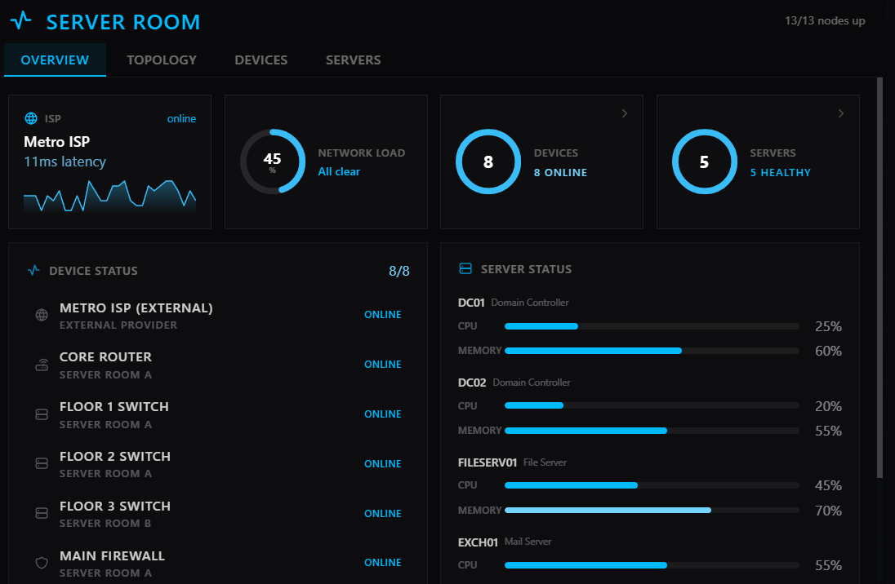
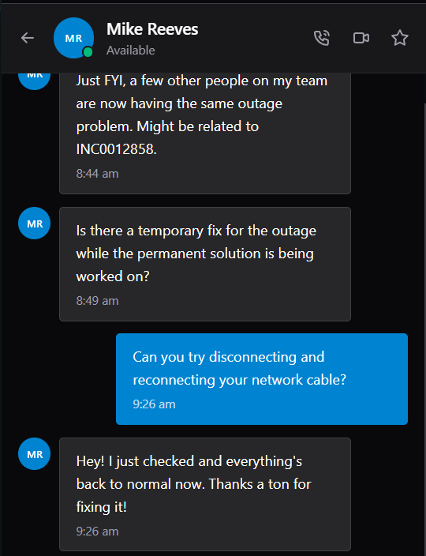

# INC0012858 – Floor 3 Internet Outage

**Priority:** Critical  
**Request Type:** Network / Infrastructure  
**Reported by:** Mike Reeves  
**Department:** Facilities  
**Location:** Floor 3  
**Date Completed:** August 14, 2026

## Summary
Entire 3rd floor lost internet connectivity (users and conference rooms). The 2nd floor remained unaffected. Multiple departments were unable to work and the Customer Service team could not access the CRM. The outage began approximately 30 minutes before the ticket was raised.

## Steps Taken
1. Claimed the Critical ticket.
2. Opened the Server Room and reviewed the network overview — one device was showing as down.
3. Navigated to the Devices tab and identified that the **Floor 3 Switch** was in an **ERROR** state.
4. Initiated a reboot of the Floor 3 Switch.
5. Monitored the switch until it returned to ONLINE status.
6. Confirmed the overall network overview showed all devices healthy again.
7. Received confirmation from the user that internet access had been fully restored on the 3rd floor.
8. Added resolution notes and closed the ticket.

## Resolution
Root cause was a failed Floor 3 network switch.  
Rebooting the Floor 3 Switch restored full network connectivity to the entire floor. All users and conference rooms regained internet access.

## Skills Demonstrated
- Critical incident response
- Network infrastructure troubleshooting
- Identifying floor-specific switch failures
- Methodical use of Server Room / Devices monitoring tools
- Clear communication during a building-wide impact event

## Screenshots

  
*Server Room overview showing 1 device down*

  
*Floor 3 Switch showing ERROR status*

  
*Initiating reboot of the Floor 3 Switch*

  
*All devices back to healthy status after the reboot*

  
*User confirmed internet access was restored on Floor 3*
