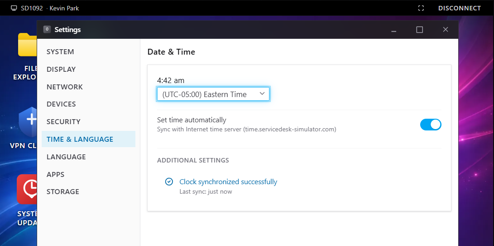
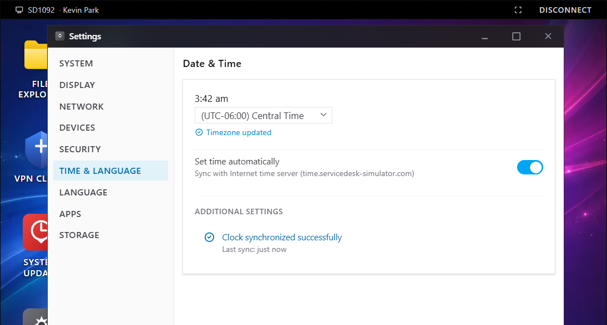

# INC0012865 – Incorrect Computer Timezone

**Priority:** High  
**Request Type:** Workstation Configuration / Timezone  
**User:** Kevin Park (`kpark`)  
**Department:** Sales  
**Location:** Floor 2  
**Date Completed:** August 20, 2026

## Summary
User reported that his computer clock was set to Eastern Time instead of Central Time. The minutes were also slightly incorrect. This caused Team Chat meetings to appear at the wrong times, resulting in a missed meeting, and file timestamps were inaccurate. Additional meetings were scheduled for the same afternoon.

## Steps Taken
1. Claimed the high-priority ticket.
2. Performed identity verification with the user.
3. Initiated a remote support session to the workstation.
4. Opened Settings → Time & Language → Date & Time.
5. Changed the timezone from **(UTC-05:00) Eastern Time** to **(UTC-06:00) Central Time**.
6. Confirmed that “Set time automatically” was enabled and the clock synchronized successfully with the time server.
7. Verified the correct time was now displayed.
8. Added resolution notes and closed the ticket.

## Resolution
Timezone successfully updated from Eastern to Central.  
Clock is now synchronized and displaying the correct local time. Meetings and file timestamps should no longer be offset.

## Skills Demonstrated
- Remote desktop support
- Timezone and regional settings configuration
- Identity verification before making changes
- High-priority user productivity issue resolution

## Screenshots

  
*Workstation incorrectly set to Eastern Time*

  
*Timezone successfully changed to Central Time and clock synchronized*
