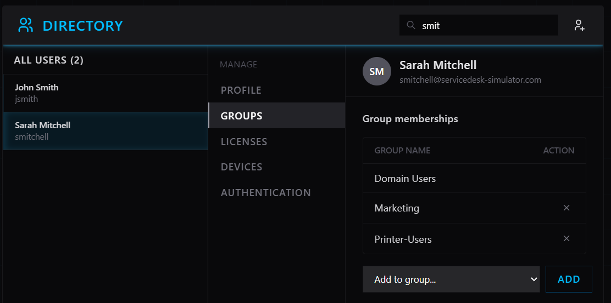
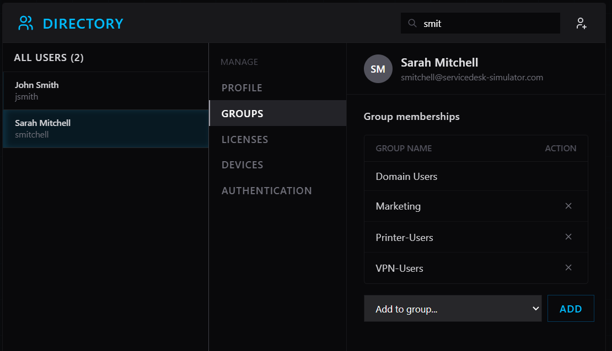
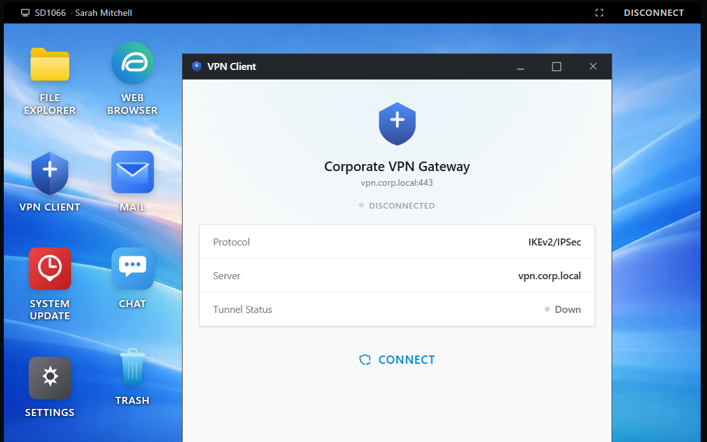
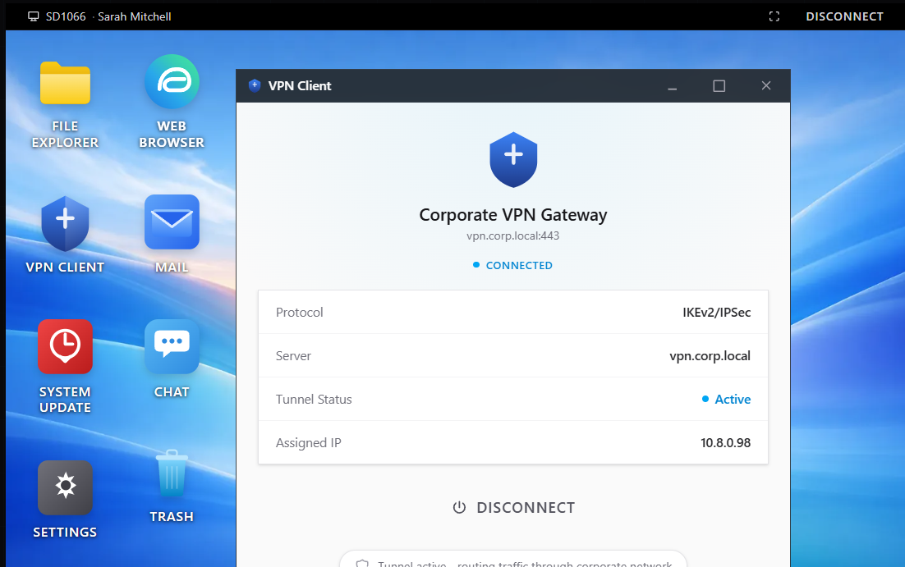
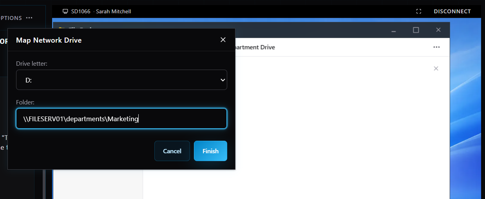

# INC0012847 – Cannot Access Marketing Shared Drive

**Priority:** High  
**Request Type:** Remote Access / File Share  
**User:** Sarah Mitchell (`smitchell`)  
**Department:** Marketing  
**Location:** Remote (Working from home)  
**Date Completed:** August 22, 2026

## Summary
Remote user was unable to access the Marketing shared drive. She received the error “The network path was not found” and her mapped drives showed as disconnected. Internet and email were working normally. This blocked access to campaign files with a deadline the following day.

## Steps Taken
1. Claimed the high-priority ticket.
2. Checked the user’s group memberships in Directory and found she was missing from the **VPN-Users** group.
3. Added the user to the VPN-Users group.
4. Initiated a remote support session to the user’s workstation.
5. Opened the VPN Client and found it was **DISCONNECTED**. Connected to the Corporate VPN Gateway.
6. Confirmed the VPN tunnel became active.
7. Opened File Explorer → Map network drive.
8. Mapped drive letter **D:** to the Marketing UNC path: `\\FILESERV01\departments\Marketing`.
9. Confirmed the drive opened successfully and the user could access the files.
10. Added resolution notes and closed the ticket.

## Resolution
Two issues were resolved:
- User was missing from the VPN-Users group → membership restored.
- VPN was disconnected → reconnected.
- Marketing shared drive was remapped as D:.

User regained full access to the Marketing department files.

## Skills Demonstrated
- Remote access and VPN troubleshooting
- Active Directory group management
- Network drive mapping
- File share access restoration for remote workers
- High-priority incident handling

## Screenshots

  
*User missing from VPN-Users group*

  
*VPN-Users group membership restored*

  
*VPN Client showing disconnected status*

  
*VPN successfully connected with active tunnel*

  
*Mapping D: drive to \\FILESERV01\departments\Marketing*
